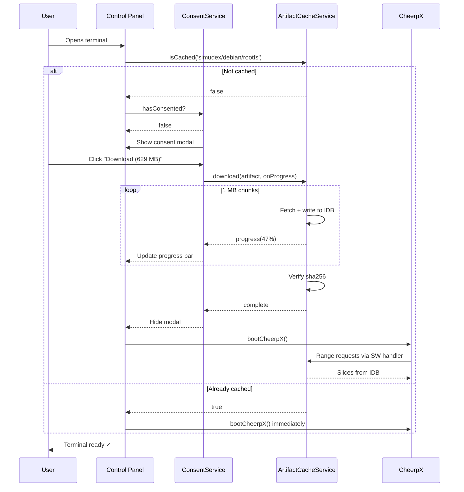

# Simudex Offline Sandbox Plan

> **Temporary** — delete after implementation.

## Problem

The Debian terminal works online (range requests to `runtime.simudex.org`) but cannot run offline. Each `ls`, `mkdir` etc. makes fresh XHR range requests to R2. The rootfs (629 MB) is never cached locally. Future sandboxes (Redis, Postgres, MongoDB) will have the same problem.

## Goal

Generic artifact download + consent system so any sandbox can ask the user for permission, download its data once, and then run fully offline.

---

## Phase 1 — Consent System

**Goal**: Reusable infrastructure. Any feature can ask the user for permission before a large download.

### Files

```
src/core/consent-config.ts                       ← Interfaces
src/services/platform/consent.service.ts          ← ask(), hasConsented(), reportProgress()
src/services/platform/consent.service.spec.ts     ← Tests
src/components/consent-modal/
  consent-modal.component.ts                      ← Standalone component
  i18n/en.ts                                      ← Translations
  i18n/fr.ts
  i18n/es.ts
  i18n/zh.ts
```

### Interfaces

| Type | Purpose |
|---|---|
| `ConsentPhase` | `'prompt' \| 'downloading' \| 'complete' \| 'refused' \| 'error'` |
| `ConsentConfig` | What to display (title, description, size, icon, downloadAction, refuseMessage) |
| `ConsentState` | Phase + config + progress percentage + optional error |
| `ConsentResult` | `{ consented: boolean }` |

### ConsentModal phases

| Phase | UI |
|---|---|
| `prompt` | Icon + title + description + size badge. Buttons: **Download (X MB)** / **Not now** |
| `downloading` | Progress bar (0–100%) + ETA + **Cancel** |
| `complete` | ✅ "Ready" — auto-dismiss after 2 seconds |
| `refused` | ℹ️ refuseMessage + **Dismiss** + optional **Retry** |
| `error` | ⚠️ error message + **Retry** / **Dismiss** |

### ConsentService API

```typescript
ask(config: ConsentConfig): Promise<ConsentResult>;
hasConsented(scope: string): boolean;
reportProgress(pct: number): void;
resetConsent(scope: string): void;
readonly state: Signal<ConsentState | null>;
```

- Decisions persisted to IndexedDB (scope → decision) — user is only asked once per scope.
- If `hasConsented(scope)` returns true, `ask()` resolves immediately without showing the modal.
- `downloadAction` receives `(pct: number) => void` callback.

### Exit criteria

- [ ] Can call `consentService.ask({...})` from any component
- [ ] Modal renders all 5 phases correctly
- [ ] Decisions persist across page reloads
- [ ] Unit tests pass
- [ ] i18n strings defined for all 5 supported languages

---

## Phase 2 — Generic Artifact Cache

**Goal**: Download any large artifact to IndexedDB (1 MB chunks), report progress. Fully generic — no coupling to Debian, CheerpX, or any specific sandbox.

### Files

```
src/core/sandbox-artifact.ts                      ← SandboxArtifact, ArtifactCacheStats
src/services/sandbox/artifact-cache.service.ts     ← download(), isCached(), getStats(), evict()
src/services/sandbox/artifact-cache.service.spec.ts← Tests
src/services/sandbox/artifact-cache.sw.ts          ← Custom SW: intercepts range requests, reads from IDB
```

### Interfaces

```typescript
interface SandboxArtifact {
  id: string;                // 'simudex/debian/rootfs'
  name: string;              // 'Debian Operating System'
  sandbox: string;           // 'simudex'
  runtime: string;           // 'debian'
  manifestUrl: string;       // 'https://runtime.simudex.org/…/latest.json'
  manifest?: {
    sizeBytes: number;
    sha256: string;
    url: string;
    version: string;
  };
}

interface ArtifactCacheStats {
  artifactId: string;
  name: string;
  sandbox: string;
  runtime: string;
  totalBytes: number;
  downloadedBytes: number;
  complete: boolean;
  downloading: boolean;
}
```

### ArtifactCacheService API

```typescript
// Download
download(artifact: SandboxArtifact, onProgress: (pct: number) => void): Promise<void>;
cancel(artifactId: string): void;

// Query
isCached(artifactId: string): Promise<boolean>;
getStats(artifactId: string): Promise<ArtifactCacheStats>;
getAllStats(): Promise<ArtifactCacheStats[]>;
getTotalUsage(): Promise<number>;

// Lifecycle
evict(artifactId: string): Promise<void>;
evictAll(): Promise<void>;
```

### Storage design

```
IndexedDB: "simudex-artifact-cache"

Object store: "chunks"
  Key: "{artifactId}/{chunkIndex}"   e.g., "simudex/debian/rootfs/0000"
  Value: ArrayBuffer (1 MB)

Object store: "manifests"
  Key: "{artifactId}"
  Value: { manifest, createdAt, totalBytes, downloadedBytes }
```

### Download flow

```
1. Fetch manifest from artifact.manifestUrl → get sizeBytes, sha256, download URL
2. Create manifest entry in IDB
3. Stream download URL via fetch(), read 1 MB chunks
4. Write each chunk to IDB, increment downloadedBytes, call onProgress(pct)
5. Mark complete when all chunks stored
6. Verify sha256 integrity
```

### SW handler (`artifact-cache.sw.ts`)

Intercepts fetch requests matching any cached artifact's download URL pattern. When a range request arrives:
1. Parse `Range: bytes=start-end` header
2. Calculate which chunks cover that range
3. Read chunks from IDB
4. Assemble the response slice
5. Return `206 Partial Content` with correct `Content-Range` header

When offline: serves from IDB. When online: proxies to origin, optionally warm-caches missing chunks.

### Exit criteria

- [ ] Download 629 MB Debian rootfs to IDB, verify sha256
- [ ] Progress callback fires correctly (0→100)
- [ ] `isCached()` returns true after download, false before
- [ ] `getAllStats()` returns stats for all artifacts
- [ ] `evict()` removes chunks and manifest
- [ ] SW handler serves correct byte-range responses from IDB
- [ ] Terminal works offline after download + page reload
- [ ] Unit tests pass

---

## Phase 3 — Control Panel + Debian Terminal Integration

**Goal**: Wire consent + artifact cache into the Debian terminal boot flow. Build a collapsible control panel showing metrics for all sandboxes.

### Files

```
src/components/terminal-platform/
  terminal-control-panel.component.ts              ← New: collapsible panel
  i18n/en.ts
src/components/terminal-platform/
  terminal-shell.component.ts                      ← Modified: integrates consent + cache
src/apps/simudex/shell/
  (existing terminal routing/shell files)          ← Modified: provides control panel
```

### Control panel metrics

```
┌─────────────────────────────────────────────────┐
│  🟢 Status: Cached & Online           [− Hide]  │
│                                                 │
│  ── Debian Terminal ─────────────────────────── │
│  📦 Rootfs        629 MB    Cached ✓            │
│  💾 Overlay       2.3 MB    Your changes        │
│  🌐 Cache saved   84 MB     127 range hits      │
│  🏷️ Debian bookworm · v1.3.3 · rev 2026.05.29 │
│                                                 │
│  ── Storage ─────────────────────────────────── │
│  🗄️ Total cached  631 MB    across 1 sandbox   │
│  💿 Browser quota 2.1 GB    30% used           │
└─────────────────────────────────────────────────┘
```

| Metric | Source |
|---|---|
| Status | `navigator.onLine` + `artifactCacheService.isCached()` |
| Rootfs size / cached | `artifactCacheService.getStats()` |
| Overlay usage | IDB size of `simudex-*-overlay-*` database |
| Cache saved | SW tracks responses served from IDB vs network |
| Runtime info | Manifest metadata |
| Total cached | `artifactCacheService.getTotalUsage()` |
| Browser quota | `navigator.storage.estimate()` |

### Panel states

| App state | Panel shows |
|---|---|
| **First visit** | "Download required — 629 MB" + **Download** button |
| **Downloading** | Progress bar + ETA + **Cancel** |
| **Cached, online** | Compact green status + expand for details |
| **Cached, offline** | Amber "Offline — cached data in use" |
| **Refused consent** | "Download skipped — terminal unavailable. [Retry]" |
| **Error** | Error message + **Retry** |

### Boot flow integration

```
terminal-shell.component.ts:

  async boot() {
    const artifact = DEBIAN_ARTIFACT;

    if (await this.cache.isCached(artifact.id)) {
      // Already cached — boot directly
      return this.bootCheerpX();
    }

    const result = await this.consent.ask({
      scope: artifact.id,
      title: 'Download Required',
      description: 'The Debian terminal needs its operating system files…',
      sizeLabel: '~629 MB',
      storageLabel: 'stored securely in your browser',
      icon: 'terminal',
      downloadAction: (onProgress) =>
        this.cache.download(artifact, onProgress),
      refuseMessage: 'Without these files, the terminal cannot start.',
    });

    if (result.consented) {
      await this.bootCheerpX();
    }
  }
```

### Exit criteria

- [ ] Control panel renders all metrics correctly
- [ ] Consent modal appears on first visit
- [ ] Download progress bar works in panel
- [ ] Terminal boots after download
- [ ] Terminal works offline after cache
- [ ] Panel updates in real-time (signals)
- [ ] Evict button clears cache and resets consent
- [ ] Works for both navigated-to and direct-URL entry

---

## Sequence: full user journey



---

## Files summary

| Phase | New files | Modified files |
|---|---|---|
| 1 | `consent-config.ts`, `consent.service.ts`, `consent.service.spec.ts`, `consent-modal.component.ts`, 4× i18n | — |
| 2 | `sandbox-artifact.ts`, `artifact-cache.service.ts`, `artifact-cache.service.spec.ts`, `artifact-cache.sw.ts` | — |
| 3 | `terminal-control-panel.component.ts`, `i18n/en.ts` | Terminal shell component, routing/shell files |

---

## Non-goals (out of scope)

- P2P artifact sharing between browsers
- Incremental artifact updates (delta patches)
- Artifact compression during download
- Uploading user overlay changes back to R2
- Pre-seeding artifacts at build time (future optimization)
