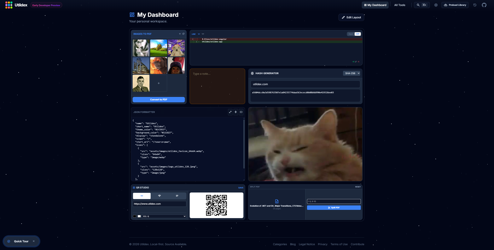
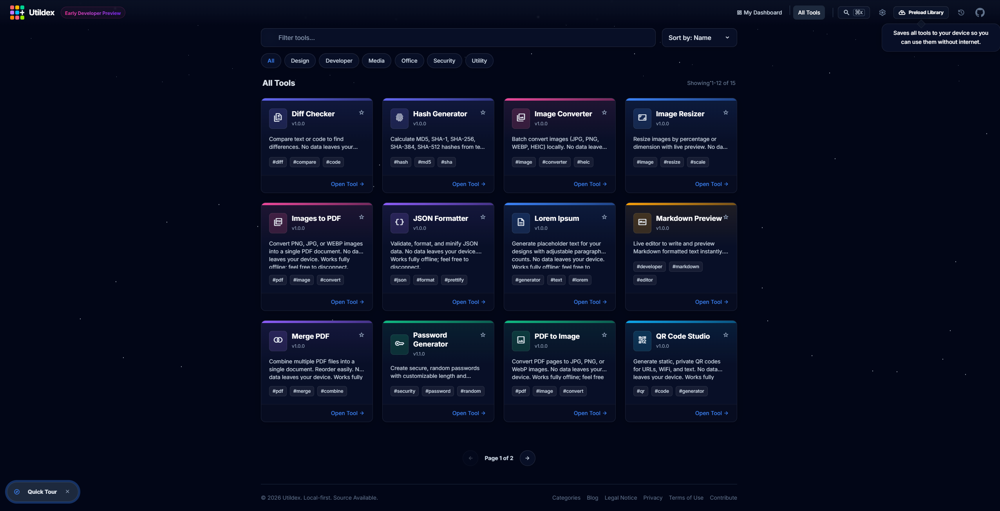
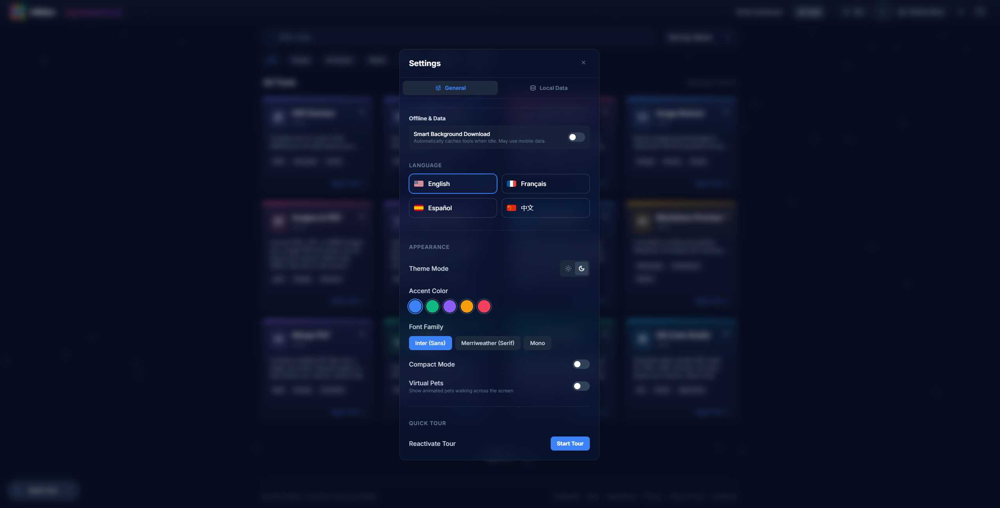
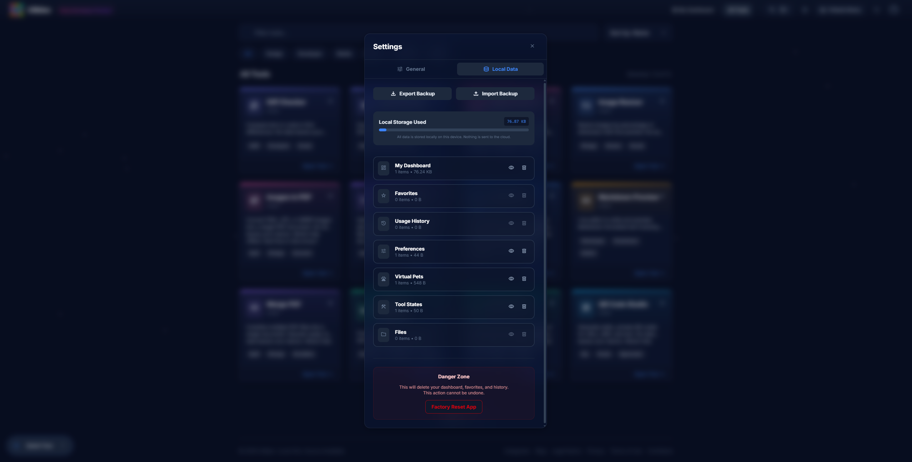
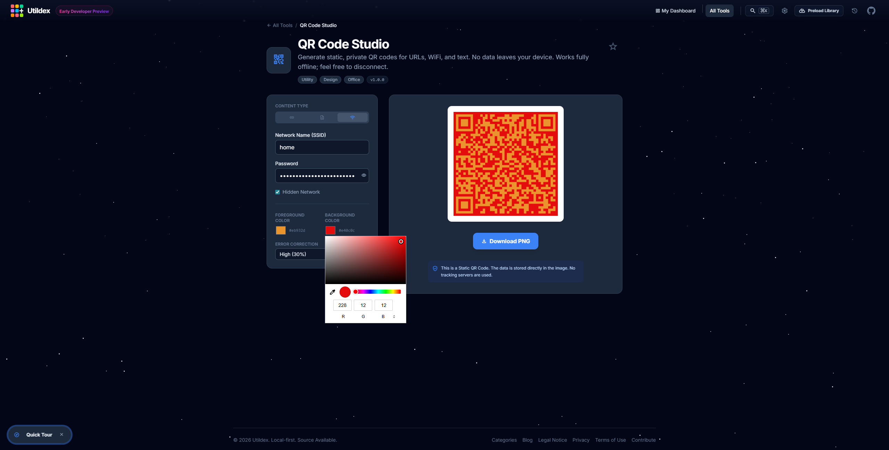

License: Apache 2.0 with Commons Clause (sale of the software is prohibited).

Utildex is an offline-friendly, privacy-first tools platform that brings practical tools, customizable widgets into one fast web app. It is designed to be self-hostable, modular, and easy to extend, so you can build a personal productivity workspace without depending on external services.

## Contents
- [Screenshots](#screenshots)
- [Self-host (Docker Compose)](#self-host-docker-compose)

## Screenshots

### 1) Welcome Page (Main Page)

 Dashboard (Widgets)
The dashboard is a fully customizable grid-based workspace in which you can setup tool widgets and fillers (notes, images...). Widgets and fillers are tiles of dimension n x n with 1 <= n <= 3.

### 3) All Tools (Tool Discovery)

### 4) Settings (General + Local Data)
The settings allow the users to control the app's behaviour and local data, whether it is language (4 available for now), accent colour, font family, factory resetting the app...

### 5) Tool example (QR Code Studio)

## Self-host (Docker Compose)

`docker compose up --build`

Then open `http://localhost:9526`.

Optional overrides:
`PORT=9384 docker compose up --build`
`APP_BASE_URL=https://your-domain.tld docker compose up --build`
